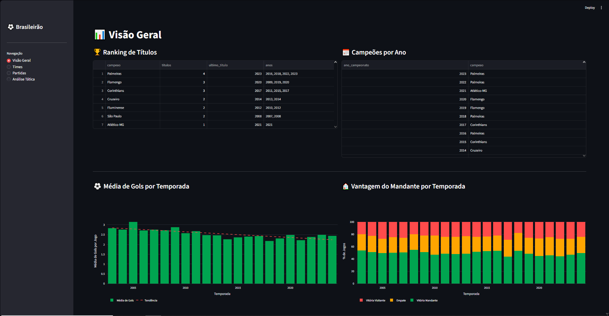
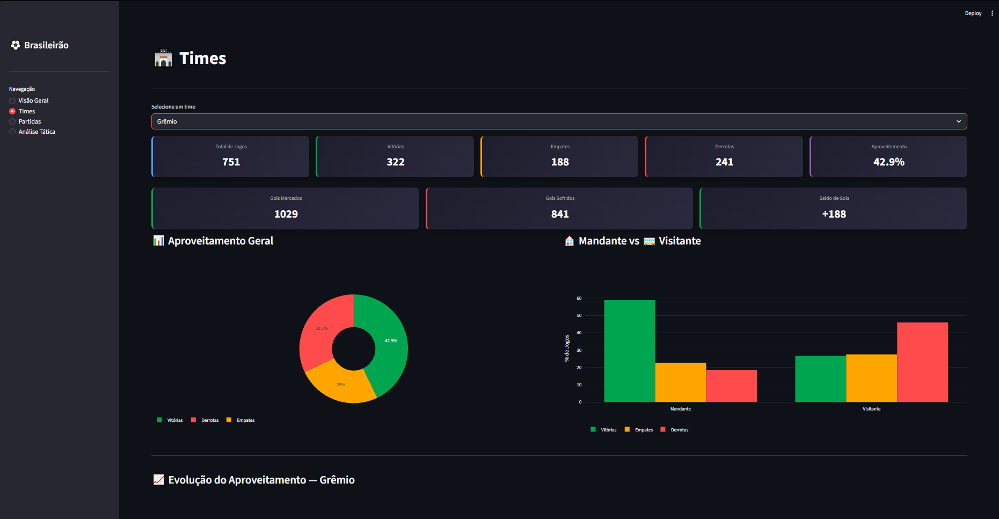
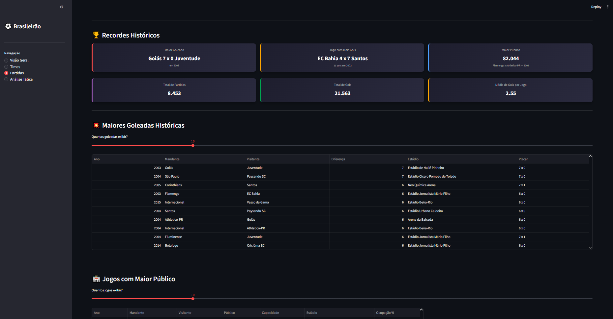
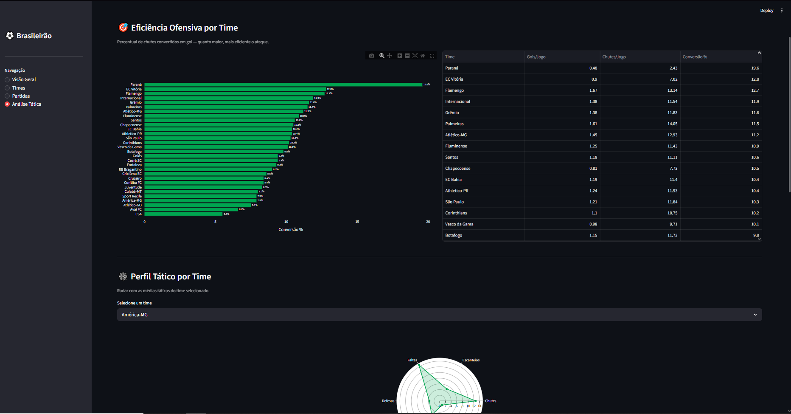

# ⚽ Brasileirão Dashboard

Dashboard interativo de análise de dados do Campeonato Brasileiro Série A (2003–2024), desenvolvido com Python e Streamlit.

---

## 📸 Preview

| Visão Geral | Times |
|---|---|
|  |  |

| Partidas | Análise Tática |
|---|---|
|  |  |

---

## 📊 Funcionalidades

### 📋 Visão Geral
- Ranking histórico de títulos com anos das conquistas
- Campeões por temporada (2003–2024)
- Média de gols por temporada com linha de tendência (regressão linear)
- Vantagem do mandante ao longo dos anos (gráfico empilhado)

### 🏟️ Times
- Cards de métricas por time: jogos, vitórias, empates, derrotas, aproveitamento, gols e saldo
- Aproveitamento geral (gráfico donut)
- Comparativo mandante vs visitante
- Evolução do aproveitamento por temporada (linha temporal)
- Head-to-head entre dois times com gráfico de tendência nos confrontos
- Ranking geral de aproveitamento de todos os times

### ⚽ Partidas
- Recordes históricos: maior goleada, jogo com mais gols, maior público
- Maiores goleadas históricas com filtro dinâmico
- Jogos com maior público e taxa de ocupação dos estádios
- Média de gols por rodada

### 📈 Análise Tática
- Eficiência ofensiva: taxa de conversão de chutes em gols por time
- Perfil tático por time (radar chart com chutes, escanteios, faltas, defesas)
- Evolução tática por temporada (chutes, faltas, escanteios, defesas)
- Desempenho de goleiros: defesas e gols sofridos por jogo
- Correlação entre número de faltas e resultado da partida

---

## 🛠️ Tecnologias Utilizadas

- **Python 3.14**
- **Streamlit** — framework para o dashboard interativo
- **Pandas** — manipulação e análise dos dados
- **Plotly** — visualizações interativas (barras, linhas, pizza, radar)
- **NumPy** — regressão linear para linha de tendência

---

## 📁 Estrutura do Projeto

```
📦 brasileirao-dashboard
├── Applib.py               # Entry point — inicializa o Streamlit
├── Menu.py                 # Menu lateral de navegação
├── conteudo.py             # Classe com toda a lógica de análise
├── data_loader1.py         # Carregamento dos dados
├── Datacleaner.py          # Limpeza e tratamento dos dados
│
├── visao_geral.py          # Página: Visão Geral
├── times.py                # Página: Times
├── partidas.py             # Página: Partidas
├── tatica.py               # Página: Análise Tática
│
└── mundo_transfermarkt_competicoes_brasileirao_serie_a.csv
```

---

## 🚀 Como Rodar Localmente

**1. Clone o repositório**
```bash
git clone https://github.com/seu-usuario/brasileirao-dashboard.git
cd brasileirao-dashboard
```

**2. Crie e ative o ambiente virtual**
```bash
python -m venv venv

# Windows
venv\Scripts\activate

# Linux/Mac
source venv/bin/activate
```

**3. Instale as dependências**
```bash
pip install -r requirements.txt
```

**4. Execute o dashboard**
```bash
streamlit run Applib.py
```

---

## 📦 Dependências

Crie um arquivo `requirements.txt` com:

```
streamlit
pandas
numpy
plotly
```

---

## 📂 Fonte dos Dados

Os dados foram obtidos através da [Base dos Dados](https://basedosdados.org/dataset/c861330e-bca2-474d-9073-bc70744a1b23), originalmente extraídos do [Transfermarkt](https://www.transfermarkt.com.br/).

O dataset cobre todas as partidas do **Campeonato Brasileiro Série A de 2003 a 2024**, totalizando **8.453 jogos** e **35 variáveis** por partida.

---

## 💡 Decisões Técnicas

- **Separação entre lógica e visualização:** toda a análise de dados está centralizada na classe `Conteudo` (`conteudo.py`), enquanto as páginas cuidam apenas da renderização — padrão similar ao MVC.
- **Pipeline de limpeza:** a classe `DataCleaner` padroniza nomes de times, corrige tipos e cria colunas derivadas (`resultado_mandante`, `total_gols`) antes de qualquer análise.
- **Cache de dados:** o `@st.cache_data` garante que o CSV seja lido apenas uma vez por sessão, melhorando a performance do dashboard.
- **Dados táticos parciais:** colunas como chutes, escanteios e faltas só existem a partir de 2017. A análise tática filtra automaticamente apenas os jogos com dados completos.

---

## 👤 Autor

Desenvolvido por **Lp.**  
[LinkedIn](https://linkedin.com/in/seu-perfil) • [GitHub](https://github.com/seu-usuario)
